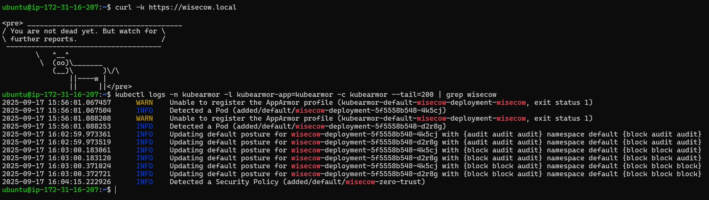

## KubeArmor Zero-Trust Policy on Wisecow

KubeArmor policy was applied successfully on the **wisecow** workload.  
Since **Minikube (Docker driver on EC2)** does not expose **AppArmor/BPF-LSM**, enforcement falls back to **audit mode**.  
The violation (`cat /etc/passwd`) **succeeds**, but KubeArmor detects the attempt and logs the policy application.  
On a kernel with AppArmor enabled, the same policy would actively **block the operation**.

